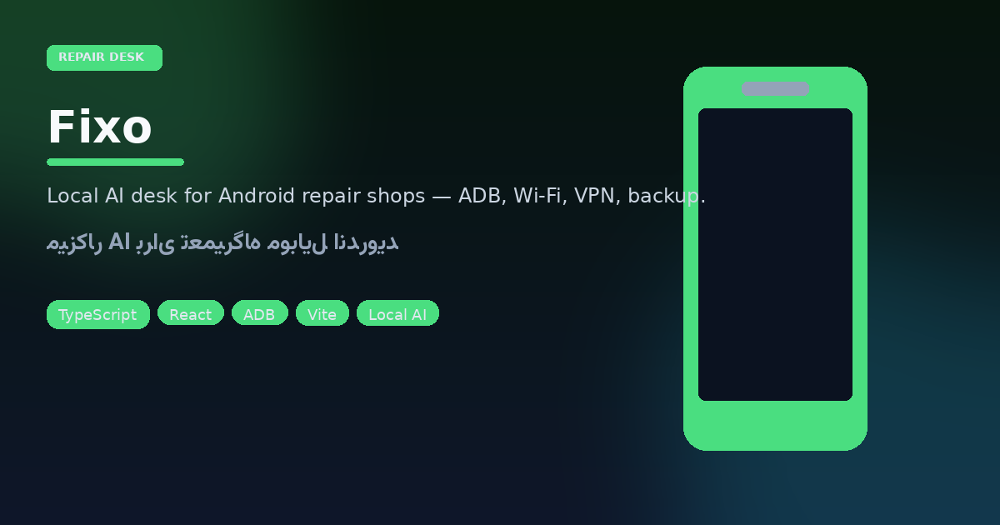

<p align="center"></p>

# Fixo
### The local AI desk for Android repair counters

<p align="center">


</p>

<p align="center">


</p>
<p align="center">


</p>

Plug a phone over USB. Fixo talks ADB so the shop can flip Wi‑Fi, push Play installs, provision Pasargad VPN (`phone@id`), assist Gmail signup, run category diagnostics, and back up media/contacts to `Desktop/Fixo-Backups` — with chat + mic for hands-free steps. Themes: Galaxy · Emerald · Ice. Persian-first, English locale ready.

## Monorepo start

```bash
pnpm install
pnpm dev          # desktop + helpers
pnpm build && pnpm test && pnpm typecheck
```

Packages under `apps/desktop` + `packages/*`. Agent/MCP network helpers via `pnpm dev:mcp`.

| Bench job | Fixo action |
|-----------|-------------|
| Shop Wi‑Fi | Connect / forget / mobile-data gate |
| Apps | Play grid + APK / GitHub / URL |
| VPN | Lookup · create · renew · delete |
| Backup | Pause / resume / cancel |

---

## فارسی — فیکسو

**میزکار هوش‌مصنوعی برای تعمیرگاه موبایل اندروید.** گوشی را با USB وصل کنید؛ فیکسو از ADB برای وای‌فای فروشگاه، نصب اپ، VPN پاسارگاد، کمک ساخت جیمیل، عیب‌یابی دسته‌بندی‌شده و بکاپ عکس/ویدیو/مخاطب استفاده می‌کند. چت و میکروفون برای دستورات بدون دست؛ سه تم بصری.

### اجرا

```bash
pnpm install && pnpm dev
```

### ارزش برای پیشخوان

- کمتر جابه‌جایی بین ابزارهای پراکنده  
- UI فارسی برای تکنسین  
- داده و بکاپ روی همان سیستم فروشگاه می‌ماند  

نسخه فعلی: `1.0.3` در `package.json`.
