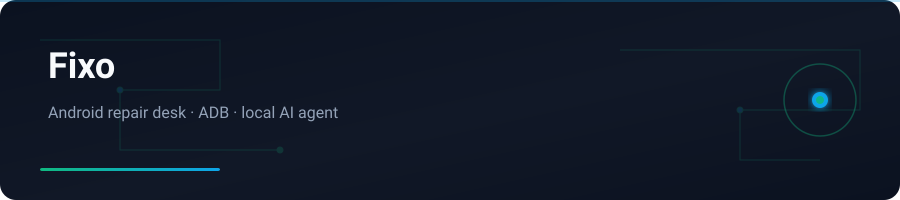

<div align="center">



</div>

# Fixo

**EN:** Local AI desk for Android phone repair shops · **FA:** میزکار هوش‌مصنوعی برای مغازه‌های تعمیرات اندروید

<p align="center">
  <a href="#english">English</a> ·
  <a href="#persian--فارسی">فارسی</a>
</p>

---

<a id="english"></a>

## English

### What is Fixo?

**Fixo** is a local desktop agent for Android repair counters. Connect a phone over USB (ADB), then manage shop Wi‑Fi, install apps from Play, provision Pasargad VPN (`phone@id`), assist Gmail signup, run phone diagnostics, and back up photos / videos / contacts — with Persian-first UI and English locale support.

### Highlights

| Area | What you get |
|------|----------------|
| **Shop network** | Toggle Wi‑Fi, connect/forget shop SSID, mobile-data gate before Play install |
| **Apps** | One-tap Play install grid + manual sources (model search, APK, GitHub, URL) |
| **VPN** | Pasargad lookup / create / renew / delete · sequential suggested shop id |
| **Gmail** | Assisted signup flow on the connected phone |
| **Phone settings** | Category diagnostics: detect / fix / technician guides |
| **Backup** | Media + contacts to `Desktop/Fixo-Backups` with pause / resume / cancel |
| **Agent** | Chat + voice mic for hands-free repair commands |
| **Themes** | Galaxy · Emerald · Ice |

### Stack

```
apps/desktop          Express API + Vite React UI + local agent
packages/mcp-network  ADB network / Wi-Fi / mobile data
packages/mcp-apps     Play install, backup, Pasargad, Gmail, phone settings
packages/shared       Shared Zod schemas
```

Node.js 22+ · pnpm · ADB · TypeScript · React · Vite

### Quick start

```bash
git clone https://github.com/yasinfallahati/fixo.git
cd fixo
pnpm install
cp .env.example .env   # fill keys
pnpm --filter @fixo/desktop build
pnpm --filter @fixo/desktop start
```

Open **http://127.0.0.1:8787**

---

<a id="persian--فارسی"></a>

## فارسی

### فیکسو چیست؟

**فیکسو** یک ایجنت دسکتاپ محلی برای پیشخوان تعمیرات اندروید است. گوشی را با USB (ADB) وصل کنید؛ بعد Wi‑Fi مغازه، نصب از Play، VPN پاسارگاد، کمک ثبت Gmail، عیب‌یابی گوشی و بکاپ عکس/ویدیو/مخاطب را مدیریت کنید — با رابط فارسی‌محور و پشتیبانی انگلیسی.

### امکانات اصلی

| حوزه | چه می‌گیرید |
|------|-------------|
| **شبکه مغازه** | روشن/خاموش Wi‑Fi، اتصال/فراموشی SSID، گیت اینترنت موبایل قبل از نصب Play |
| **اپ‌ها** | شبکه نصب Play + منابع دستی (جستجوی مدل، APK، GitHub، URL) |
| **VPN** | جستجو/ساخت/تمدید/حذف پاسارگاد |
| **Gmail** | جریان کمکی ثبت‌نام روی گوشی متصل |
| **تنظیمات گوشی** | تشخیص / رفع / راهنمای تکنسین |
| **بکاپ** | رسانه و مخاطبین با pause / resume / cancel |
| **ایجنت** | چت + میکروفون صوتی |
| **تم‌ها** | Galaxy · Emerald · Ice |

### شروع سریع

```bash
git clone https://github.com/yasinfallahati/fixo.git
cd fixo
pnpm install
cp .env.example .env
pnpm --filter @fixo/desktop build
pnpm --filter @fixo/desktop start
```

آدرس: **http://127.0.0.1:8787**

---

`#android` `#adb` `#typescript` `#react` `#repair` `#local-ai` `#persian` `#vite` `#nodejs`
